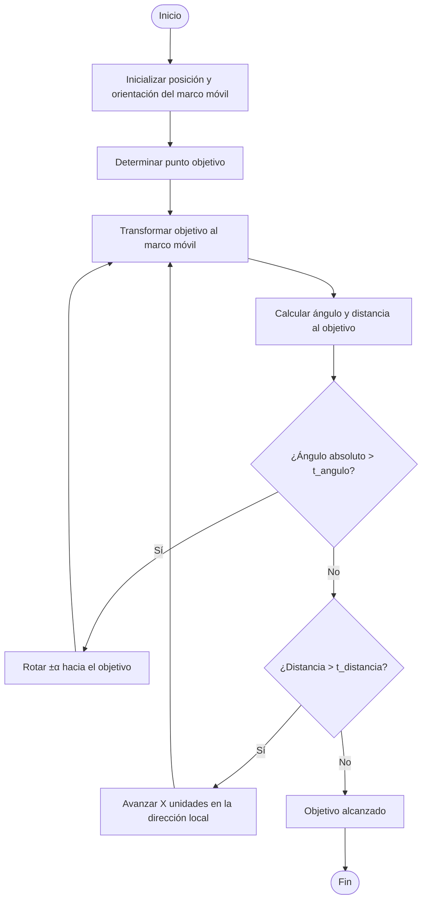

# juagomezro.github.io
# 🦂Proyecto Fundamentos de Robótica Movil - Hexapodo v2.0

## 🪶Autores

* Andres Camilo Torres Cajamarca
* Juan Camilo Gomez Robayo
* Julian Andres Gonzalez Reina
* Emily Angelica Villanueva Serna
* Elvin Andres Corredor Torres

## ℹ️Descripción
El presente proyecto propone el desarrollo de un sistema robótico móvil orientado a la recolección de objetos identificados como “basuras” (objetos de colores en forma de bola) distribuidos aleatoriamente en un entorno delimitado. El agente principal es un robot hexápodo con 18 grados de libertad, el cual contará con un sistema de visión artificial basado en una cámara cenital que permite la localización tanto del robot como de los residuos mediante técnicas de procesamiento de imagen.

El sistema de navegación del hexápodo será asistido desde MATLAB, donde se establecerán las trayectorias hacia los puntos objetivo. Una vez en proximidad de una basura, el robot ejecutará una rutina de manipulación utilizando un gripper desarrollado en manufactura aditiva. Los objetos recogidos serán transportados a dos regiones definidas de recolección, donde se completará la tarea asignada.

El sistema se implementará sobre ROS 2 Humble como middleware principal, y el control del movimiento se realizará mediante una máquina de estados o un controlador PI, según los resultados de desarrollo. La lógica de control será acoplada a rutinas previamente definidas en simulación y modificadas para adaptarse al comportamiento del entorno físico. 

## 🐾Objetivos 
* Navegar hacia las ubicaciones de las basuras detectadas. 
* Recoger objetos con el gripper implementado. 
* Transportar los objetos a una de dos zonas predefinidas de descarga. 
* Implementar un sistema de visión artificial con cámara fija cenital para:
    * Localizar en tiempo real la posición del robot (odometría por visión). 
    * Detectar la posición de los residuos (objetos de colores).
* Integrar la visión con el entorno de control en MATLAB para generar trayectorias. 
* Evaluar el desempeño del sistema de manipulación y agarre bajo diferentes condiciones de prueba. 
* Documentar todo el proceso de desarrollo y pruebas para retroalimentación académica y técnica.

## 🧺Materiales

* Robot hexápodo con 18 grados de libertad, basado en arquitectura compatible con ROS 2. 
* Gripper fabricado en manufactura aditiva, acoplado a la parte frontal de hexapodo 
* Cámara cenital de alta resolución para captura del entorno. 
* Computador con ROS 2 Humble y MATLAB instalados para ejecución de control y visión. 
* Objetos de prueba: objetos de colores en forma de bola simulando basura. 
* Entorno de simulación en CoppeliaSim para pruebas virtuales de las rutinas.

## 💻Herramientas de software

* Matlab
* CoppeliaSim
* ROS 2
* Autodesk Inventor
* Python con OpenCV

# 🌀Desarrollo 

Basados en la versión 1.0, se inicia el proceso de desarrollo de la versión 2.0, iniciando con algunas modificaciones en cuanto a Hardware enfocadas en mejorar el andar del robot.
1. Se realiza un cambio en la conexión de potencia para evitar limitaciones en la corriente del motor [💪Potencia eléctrica](#potencia-el%C3%A9ctrica) 
2. Se realiza la impresión de una carcaza que cubre los circuitoe y elementos que controlan el robot, además, peromite la ubicacióin de un indicador para el sistema de visón que indicará la orientación del robot. [🐢Diseño y contruccion de la carcasa](#dise%C3%B1o-y-contruccion-de-la-carcasa)
3. Se realiza el desarrollo de un griper, el cuál se va a encargar de sujetar la lata que se va a seleccionar de acuerdo a su color, para el desarrollo de este gripper se tomó como base la tería de gripper flexible o adaptable a la superficie a sujetar (Soft-Gripping). Este griper diseñado se imprime en PLA y es actuado por un servomotor, el cual se ubica en la parte frontal del robot para de esta manera hacer la sujeción de los elementos a clasificar. [🖐️Diseño y construccion del Gripper](#%EF%B8%8Fdise%C3%B1o-y-construccion-del-gripper)
4. Se instala una cámara IP la cual se ubica en la parte superior del entorno. [📷Configuración de cámara](#configuraci%C3%B3n-de-c%C3%A1mara)
5. Se implementa un módulo de visión de máquina que se va a encargar del la captura de imágenes y la elaboración del mapa global. [👁️Detección y localizacion con OpenCV](#dise%C3%B1o-y-contruccion-de-la-carcasa)
6. Utilizando técnicas de generación de trayectorias se implementa un algoritmo de navegación PRM usando Matlab. [v📐Generacion de Trayectorias](#generacion-de-trayectorias)
7. En cuanto a la programación, se cambia la forma en que se envía la información a los motores, esto con el fin de reducir el volumen de datos enviados por el canal TTL, ya que se evidenció la saturación del buffer debido a la cantidad de información enviada, teniendo en cuenta que son 18 motores y a cada uno se le envía información por el mísmo canal. [🎮Control](#control)

## 💪Potencia eléctrica
La versión 1.0 del Hexapodo tenia implementado una placa U2D2 que tiene una corriente máxima de operación de 10 Amperios, teniendo en cuenta que los motores en conjunto consumen una corriente mayor, se procedió a reenplazarla por un HUB que no limita la corriente, en la sigueinte imágen se presenta la tarjeta reemplazada y el HUB en su lugar de operación dentro del robot. Esto hizo parte de las mejoras en cuanto a [seccion](#hardware)

  

## 🖐️Diseño y construccion del Gripper
Comenzando con el desarrollo del proyecto, se tuvo a discusion el tipo de agarre que se iba a diseñar para el robot, en primera etapa se habia determinado un tipo de garra mecánica, la cual es activada con un motor que permite la apertura o el cierre de la garra como se ve.

  

En el proceso de diseño se nos aconsejo una opción de diseño con robotica suave para el agarre, esto con el fin de poder atrapar diferentes geometrias de "Basuras", optando finalmente por esta ultima. Realizando un nuevo diseño de gripper se tuvó en cuenta tanto la altura donde poner el gripper respecto a las "basura" que debia recoger, siendo acorde con la cinematica del robot situarlo debajo del nivel de los motores, además se ecogio una forma en la que la revolución del eje del motor 
A continuacion se presenta el diseño de Solidworks.

  

Para la construccion del Gripper se utilizo un motor MG90 como actuador, por otro lado, se fabricaron las abrazaderas en un material Flexible (TPU), los soportes para el motor se fabricaron en un material rigido (PLA) y para aumentar el agarre se colocaron circulos de silicona. En la siguientes imagenes se puede ver su contruccion final.

  
  

## 🏞️Descripción del entorno
Para que la cámara y el robot tengan un espacio adecuado se utiliza un plano de color blanco el cual tiene dos zonas coloreadas para separar los objetos de acuerdo a su color (Azul y Verde). Este plano tiene medidas de 101 cm x 204 cm y las zonas donde se ubican los elementos separados son de 30 cm x 54 cm cada una.

## 🐢Diseño y contruccion de la carcasa

Para localizar el robot, se emplean imágenes capturadas por una cámara cenital y procesadas con OpenCV en Python. No obstante, una sola fotografía no es suficiente para determinar con precisión su posición y orientación; por ello se ha diseñado una carcasa que incorpora una flecha de referencia roja, elemento clave para calcular ambos parámetros en el entorno. A continuación se muestra el robot equipado con esta carcasa y su flecha indicadora.

  
  

## 📷Configuración de cámara
Para la captura del entorno se realizó el montaje de la cámara IP modelo C18PROX-F-4mm en la grua Maya, a través del protocolo RTSP se establece la comunicación para la obtención de las imágenes.

  

  
El link de conexión de la cámara es el siguiente: rtsp://192.168.1.234/live/ch00_0

## 👁️Detección y localizacion con OpenCV

Para llevar a cabo la identificación y el posicionamiento de objetos, se emplearon las bibliotecas de OpenCV en Python. Se definió que los elementos a recolectar serían de color azul o verde, al igual que las áreas donde debían ubicarse. Con el fin de determinar con precisión la posición y orientación del robot, se añadió una flecha roja junto a un punto amarillo que marca su centroide. A continuación se muestra una imagen que ilustra el robot y los objetos en su zona de trabajo.

  

Una vez capturada la imagen, se procesa con OpenCV para extraer las posiciones de los objetos y del robot. Para ello, se aplican máscaras de color verde, azul y amarillo que permiten segmentar las áreas ocupadas por cada objeto y calcular sus centroides. De forma análoga, se utiliza una máscara roja para identificar la flecha del robot y, a partir de ella, determinar su orientación. La siguiente imagen ilustra tanto la detección de los centroides de los objetos como la localización y dirección del robot.

  

## 📐Generacion de Trayectorias 

Para la genereción de trayectorias se utiliza matlab, en este caso se realizó un algoritmo que genera la trayectoria a travez del método PRM donde dependiendo del color del objeto deja como punto final la zona del respectivo color. Finalmente se envian los datos a Ros mediante el ROS toolbox de matlab .  

   
   

[//]: 

[//]:   
[//]:   
[//]: 

Para prueba offline, se realizó una prueba con un sensor vision en CoppeliaSim:

   <video src='https://github.com/user-attachments/assets/f4cc59f9-5256-44a3-b3f2-1b54d90f1186'>

## 🎮Control

Para el algoritmo de control, se tuvo en cuenta que el robot emplea rutinas predefinidas que por simplicidad no se modificaran para evitar rehacer la cinematica; por ello se realizó un control como una _maquina de estados discreta_, para ello se siguió el siguiente diagrama de flujo:

Donde $\alpha$ es el angulo fijo de giro, $X$ es el desplazamiento fijo, $t_{angulo}$ es la tolerancia de angulo y $t_{distancia}$ es la tolerancia de distancia; las 4 son variables que se ajustan dependiendo del robot. 

Para probar su funcionamiento se realizó el código de matlab [Prueba_Control_Matlab.mlx](Archivos/Prueba_Control_Matlab.mlx) en el que se realizaron diferentes pruebas variando el objetivo y asignando $\alpha=10°$, $x=3$, $t_{angulo}=5°$ y $t_{distancia}=1$ con ello se obtuvieron las siguientes simulaciones:

  <video src="https://github.com/user-attachments/assets/e21c846a-7afd-427c-8631-f6ba4e09c12d"></video>

Como se puede observar, en la mayoria de los casos se logra llegar al objetivo. No obstante se detectaron 2 limitantes principales a tener en cuenta:

1. El robot no puede pasar por encima del objeto. (Video 'Control a Obj=(-5,-3)')
2. Debido al angulo y desplazamiento fijos se puede llegar a un bucle tratando de llegar al objetivo. (Video 'Control a Obj=(5,2)')

Posteriormente, se realizó el calculo de avance de 1 vez la rutina de avance y de 1 vez la rutina de giro

   

dando

* Avance: 12cm-13cm
* Giro: 12°-12.5°

Por otro lado, se determinó que las tolerancias serian de 

* Tolerancia de distancia: 18cm (distancia entre centro del robot al centro del gripper)
* Tolerancia de giro: 8° (minimiza la posibilidad de entrar en bucle)

## 🏗️ROS 2

Para el diseño de la arquitectura de ROS2 se tomó la ya implementada en la versión original del [Hexapodo](https://github.com/labsir-un/Hexapod_Unal)

   

A partir de esta, se modificó el funcionamiento de los siguientes nodos:

* Gui_node: Se modificó la entrada al nodo para que otro nodo lo pudiera controlar mediante una acción llamada 'enviar_paso'
* Transformation_node: Se modificó para evitar saturación en canales de comunicación y se le implementó seguimiento de finalización de rutina
* Cinematica_node: Se modificó para poder determinar la cantidad $n$ de veces que se repite la rutina solicitada

Con ello, se crearon los siguientes nodos:

* Control_node: Se encarga del seguimiento de trayectoria. Se le implementa la lógica descrita en la sección [Control](#-control)
* Gripper_node: Realiza el movimiento del gripper por medio de los pines GPIO de la RaspBerry Pi.
* Vision_node: Encargado de la toma de imagenes con la cámara y el analisis de las mismas para detección de objetos, entorno y pose del robot.
* Planner_node: Nodo que realiza la coordinación de la secuencia.

Por otro lado, se configuró ROS2 para ejecución en red, esto con el fin de disminuir la carga computacional de la RaspBerry Pi ubicada en el robot, por lo cual, en ella solo corren los nodos _Dynamixel\_node_ y _Gripper\_node_, el resto de nodos corren de manera local en un pc con los requerimientos descritos en la sección del repositorio original '[Using Laptop](https://github.com/labsir-un/Hexapod_Unal?tab=readme-ov-file#using-laptop)'

Ya con los nodos definidos, se llegó a la siguiente arquitectura de ROS2

## CoppeliaSim

Se creó la siguiente escena en CoppeliaSim, como base para el funcionamiento, dicha escena se encuentra en el archivo [Robot_Completo_off.ttt](vrep/Robot_Completo_off.ttt)

   

## 📽️Videos

   <video src='https://github.com/user-attachments/assets/633802ea-49ef-4547-a2cb-4d6662b73acb'>

   <video src='https://github.com/user-attachments/assets/947bb8c3-d565-4bb7-aaa4-40f83d039cd8'>

## 💔Dificultades en el proceso

* Uno de los motores se sobrecalentó y terminó averiándose después de aproximadamente 15 minutos de funcionamiento continuo. Como consecuencia, el gripper dejó de operar correctamente.

* El entorno del mapa presentaba condiciones de fricción que inicialmente impedían el movimiento suave del robot.

* El canal de comunicación encargado de enviar comandos de movimiento al robot se saturaba, con una duración máxima de operación continua cercana a los 4 minutos.

## 🍂Autoevaluacion Grupal

## 🍃Autoevaluacion Individual

## 📚Bibliografía

Este proyecto no sería posible sin el desarrollo previo del Hexapodo, para mayor información del **_Hexapodo_** desarrollado por [Felipe Chaves Delgadillo](mailto:fchaves@unal.edu.co) y [Andres Camilo Torres Cajamarca](mailto:antorresca@unal.edu.co) consultar el [repositorio](https://github.com/labsir-un/Hexapod_Unal) de la organización [LabSir](https://github.com/labsir-un) de la Universidad Nacional de Colombia 
