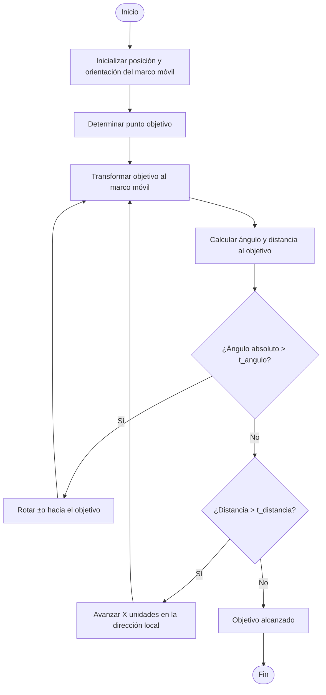

# 🦂Proyecto Fundamentos de Robótica Movil - Hexapodo v2.0

## 🪶Autores

* Andres Camilo Torres Cajamarca
* Juan Camilo Gomez Robayo
* Julian Andres Gonzalez Reina
* Emily Angelica Villanueva Serna
* Elvin Andres Corredor Torres

## ℹ️Descripción

## 🕷️Hexapodo v1.0

Para mayor información del **_Hexapodo_** desarrollado por [Felipe Chaves Delgadillo](mailto:fchaves@unal.edu.co) y [Andres Camilo Torres Cajamarca](mailto:antorresca@unal.edu.co) consultar el [repositorio](https://github.com/labsir-un/Hexapod_Unal) de la organización [LabSir](https://github.com/labsir-un) de la Universidad Nacional de Colombia 

## 🎮 Control

Para el algoritmo de control, se tuvo en cuenta que el robot emplea rutinas predefinidas que por simplicidad no se modificaran para evitar rehacer la cinematica; por ello se realizó un control como una _maquina de estados discreta_, para ello se siguió el siguiente diagrama de flujo:

```mermaid
%%{init: {"theme": "default", "flowchart": {"nodeSpacing": 50, "rankSpacing": 60, "fontSize": 8}}}%%
flowchart TD
    Start([Inicio])
    Init1[Inicializar posición y orientación del marco móvil]
    Init2[Determinar punto objetivo]
    Transform[Transformar objetivo al marco móvil]
    Calc[Calcular ángulo y distancia al objetivo]
    CheckAngle{¿Ángulo absoluto > t_angulo?}
    Turn[Rotar ±α hacia el objetivo]
    CheckDist{¿Distancia > t_distancia?}
    Advance[Avanzar X unidades en la dirección local]
    Done[Objetivo alcanzado]
    Finish([Fin])

    Start --> Init1 --> Init2 --> Transform --> Calc --> CheckAngle

    CheckAngle -- Sí --> Turn --> Transform
    CheckAngle -- No --> CheckDist

    CheckDist -- Sí --> Advance --> Transform
    CheckDist -- No --> Done
    Done --> Finish
```

Donde $\alpha$ es el angulo fijo de giro, $X$ es el desplazamiento fijo, $t_{angulo}$ es la tolerancia de angulo y $t_{distancia}$ es la tolerancia de distancia; las 4 son variables que se ajustan dependiendo del robot. 

Para probar su funcionamiento se realizó el código de matlab [Prueba_Control_Matlab.mlx](Archivos/Prueba_Control_Matlab.mlx) en el que se realizaron diferentes pruebas variando el objetivo y asignando $\alpha=10°$, $x=3$, $t_{angulo}=5°$ y $t_{distancia}=1$ con ello se obtuvieron las siguientes simulaciones:

  <video src="https://github.com/user-attachments/assets/e21c846a-7afd-427c-8631-f6ba4e09c12d"></video>

Como se puede observar, en la mayoria de los casos se logra llegar al objetivo. No obstante se detectaron 2 limitantes principales a tener en cuenta:

1. El robot no puede pasar por encima del objeto. (Video 'Control a Obj=(-5,-3)')
2. Debido al angulo y desplazamiento fijos se puede llegar a un bucle tratando de llegar al objetivo. (Video 'Control a Obj=(5,2)')

Para ello, se tuvo en cuenta los siguientes datos del robot:

